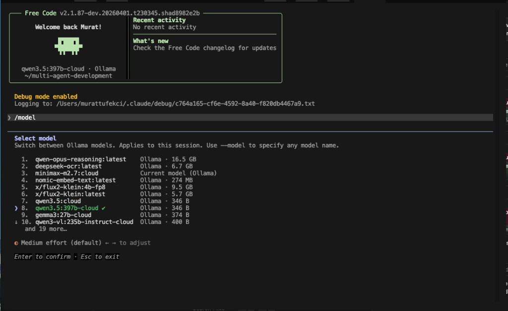

# free-code

**The free build of Claude Code — now with full Ollama support.**

All telemetry stripped. All injected security-prompt guardrails removed. All experimental features unlocked. Full local LLM support via Ollama. WebBrowser tool with Playwright. One binary, zero callbacks home.

```bash
git clone https://github.com/mtufekci/free-code.git
cd free-code && bun install && bun run build:dev
```

> Clone, install, build — then run `./cli-dev`. Works with Anthropic API keys **or** local Ollama models.

<p align="center">
  
</p>

---

## What is this

This is a clean, buildable fork of Anthropic's [Claude Code](https://docs.anthropic.com/en/docs/claude-code) CLI -- the terminal-native AI coding agent. The upstream source became publicly available on March 31, 2026 through a source map exposure in the npm distribution.

This fork applies three categories of changes on top of that snapshot:

### 1. Telemetry removed

The upstream binary phones home through OpenTelemetry/gRPC, GrowthBook analytics, Sentry error reporting, and custom event logging. In this build:

- All outbound telemetry endpoints are dead-code-eliminated or stubbed
- GrowthBook feature flag evaluation still works locally (needed for runtime feature gates) but does not report back
- No crash reports, no usage analytics, no session fingerprinting

### 2. Security-prompt guardrails removed

Anthropic injects system-level instructions into every conversation that constrain Claude's behavior beyond what the model itself enforces. These include:

- Hardcoded refusal patterns for certain categories of prompts
- Injected "cyber risk" instruction blocks
- Managed-settings security overlays pushed from Anthropic's servers

This build strips those injections. The model's own safety training still applies -- this just removes the extra layer of prompt-level restrictions that the CLI wraps around it.

### 3. Full Ollama integration (local-first LLM)

Run the entire Claude Code experience with local models — no API key needed, no cloud dependency:

- **Drop-in Ollama support** — set `CLAUDE_CODE_USE_OLLAMA=1` and go
- **Auto-detection** of model capabilities (tools, vision, thinking) via `/api/show`
- **Streaming** with proper Anthropic event translation (NDJSON → SSE)
- **Tool calling** works with all 23+ built-in tools (schemas correctly mapped to OpenAI function-calling format)
- **ULTRATHINK** works with models that support thinking (e.g. `qwen3:8b`, `qwen3.5`)
- **Proper 3P provider handling** — Ollama is treated as a first-class third-party provider, bypassing all Anthropic auth, OAuth, grove checks, and quota status calls
- **Dynamic model listing** — `/model` picker fetches available models from your running Ollama instance

Tested with: `qwen3:8b`, `qwen3.5:397b-cloud`, `qwen3-vl:235b`, `llama3.1`, `mistral`, `deepseek-r1`

### 4. WebBrowser tool (Playwright)

A new built-in tool that gives the model a real headless browser:

- Navigate to URLs and read rendered page content
- Click elements, fill forms, interact with dynamic pages
- Take screenshots, execute JavaScript, wait for elements
- Uses Playwright with Chromium — works in headless and headed mode
- Fully integrated into the tool permission system

### 5. Experimental features enabled

Claude Code ships with dozens of feature flags gated behind `bun:bundle` compile-time switches. Most are disabled in the public npm release. This build unlocks all 45+ flags that compile cleanly, including:

| Feature | What it does |
|---|---|
| `ULTRAPLAN` | Remote multi-agent planning on Claude Code web (Opus-class) |
| `ULTRATHINK` | Deep thinking mode -- type "ultrathink" to boost reasoning effort |
| `VOICE_MODE` | Push-to-talk voice input and dictation |
| `WEB_BROWSER_TOOL` | Playwright-based browser automation (navigate, click, fill, screenshot) |
| `AGENT_TRIGGERS` | Local cron/trigger tools for background automation |
| `BRIDGE_MODE` | IDE remote-control bridge (VS Code, JetBrains) |
| `TOKEN_BUDGET` | Token budget tracking and usage warnings |
| `BUILTIN_EXPLORE_PLAN_AGENTS` | Built-in explore/plan agent presets |
| `VERIFICATION_AGENT` | Verification agent for task validation |
| `BASH_CLASSIFIER` | Classifier-assisted bash permission decisions |
| `EXTRACT_MEMORIES` | Post-query automatic memory extraction |
| `HISTORY_PICKER` | Interactive prompt history picker |
| `MESSAGE_ACTIONS` | Message action entrypoints in the UI |
| `QUICK_SEARCH` | Prompt quick-search |
| `SHOT_STATS` | Shot-distribution stats |
| `COMPACTION_REMINDERS` | Smart reminders around context compaction |
| `CACHED_MICROCOMPACT` | Cached microcompact state through query flows |

See [FEATURES.md](FEATURES.md) for the full audit of all 88 flags and their status.

---

## Quick install

```bash
git clone https://github.com/mtufekci/free-code.git
cd free-code
bun install
bun run build:dev
```

After build, run with Anthropic or Ollama:
```bash
# With Anthropic API
export ANTHROPIC_API_KEY="sk-ant-..."
./cli-dev

# With Ollama (no API key needed)
export CLAUDE_CODE_USE_OLLAMA=1
export OLLAMA_MODEL=qwen3:8b
./cli-dev
```

---

## Requirements

- [Bun](https://bun.sh) >= 1.3.11
- macOS or Linux (Windows via WSL)
- **One of:**
  - An Anthropic API key (`ANTHROPIC_API_KEY`), **or**
  - [Ollama](https://ollama.com) running locally with a model pulled

```bash
# Install Bun if you don't have it
curl -fsSL https://bun.sh/install | bash

# Optional: install Ollama for local LLM support
curl -fsSL https://ollama.com/install.sh | sh
ollama pull qwen3:8b
```

---

## Build

```bash
# Clone the repo
git clone https://github.com/mtufekci/free-code.git
cd free-code

# Install dependencies
bun install

# Standard build -- produces ./cli
bun run build

# Dev build -- dev version stamp, experimental GrowthBook key
bun run build:dev

# Dev build with ALL experimental features enabled -- produces ./cli-dev
bun run build:dev:full

# Compiled build (alternative output path) -- produces ./dist/cli
bun run compile
```

### Build variants

| Command | Output | Features | Notes |
|---|---|---|---|
| `bun run build` | `./cli` | `VOICE_MODE` only | Production-like binary |
| `bun run build:dev` | `./cli-dev` | All experimental flags + Ollama + WebBrowser | **Recommended** — full unlock build |
| `bun run build:dev:full` | `./cli-dev` | All experimental flags | Same as `build:dev` |
| `bun run compile` | `./dist/cli` | `VOICE_MODE` only | Alternative output directory |

### Individual feature flags

You can enable specific flags without the full bundle:

```bash
# Enable just ultraplan and ultrathink
bun run ./scripts/build.ts --feature=ULTRAPLAN --feature=ULTRATHINK

# Enable a specific flag on top of the dev build
bun run ./scripts/build.ts --dev --feature=BRIDGE_MODE
```

---

## Run

### With Anthropic API

```bash
export ANTHROPIC_API_KEY="sk-ant-..."
./cli-dev
```

### With Ollama (local, no API key needed)

```bash
export CLAUDE_CODE_USE_OLLAMA=1
export OLLAMA_MODEL=qwen3:8b        # or any model you've pulled
./cli-dev
```

You can also set `OLLAMA_BASE_URL` if Ollama isn't on `localhost:11434`.

### Quick test

```bash
# One-shot mode (Anthropic)
./cli-dev -p "what files are in this directory?"

# One-shot mode (Ollama)
CLAUDE_CODE_USE_OLLAMA=1 OLLAMA_MODEL=qwen3:8b ./cli-dev -p "read README.md and summarize it"

# Interactive REPL (default)
./cli-dev

# Switch model at runtime
# Type /model in the REPL to pick from available models

# Use the WebBrowser tool
CLAUDE_CODE_USE_OLLAMA=1 OLLAMA_MODEL=qwen3:8b ./cli-dev -p "use WebBrowser to navigate to https://example.com and tell me the page title"
```

---

## Project structure

```
scripts/
  build.ts              # Build script with feature flag system

src/
  entrypoints/cli.tsx   # CLI entrypoint
  commands.ts           # Command registry (slash commands)
  tools.ts              # Tool registry (agent tools)
  QueryEngine.ts        # LLM query engine
  screens/REPL.tsx      # Main interactive UI

  commands/             # /slash command implementations
  tools/                # Agent tool implementations (Bash, Read, Edit, WebBrowser, etc.)
  components/           # Ink/React terminal UI components
  hooks/                # React hooks
  services/             # API client, MCP, OAuth, analytics
  state/                # App state store
  utils/                # Utilities
  skills/               # Skill system
  plugins/              # Plugin system
  bridge/               # IDE bridge
  voice/                # Voice input
  tasks/                # Background task management
```

---

## Tech stack

| | |
|---|---|
| Runtime | [Bun](https://bun.sh) |
| Language | TypeScript |
| Terminal UI | React + [Ink](https://github.com/vadimdemedes/ink) |
| CLI parsing | [Commander.js](https://github.com/tj/commander.js) |
| Schema validation | Zod v4 |
| Code search | ripgrep (bundled + system fallback) |
| Browser automation | [Playwright](https://playwright.dev) (Chromium) |
| Protocols | MCP, LSP |
| LLM providers | Anthropic API, Ollama (local), Bedrock, Vertex |

---

## Ollama integration details

The Ollama integration is a full rewrite of the API client layer, not a simple proxy:

| Component | What was done |
|---|---|
| **API client** (`ollama.ts`) | Custom client mimicking Anthropic SDK interface — translates requests/responses bidirectionally |
| **Streaming** | NDJSON → Anthropic SSE event translation with proper `content_block_start/delta/stop` events |
| **Tool schemas** | Anthropic `input_schema` → OpenAI function-calling `parameters` format |
| **Tool responses** | Ollama tool call results → Anthropic `tool_result` block format |
| **Model capabilities** | Auto-detected via `/api/show` — tools, vision, thinking support per model |
| **Auth bypass** | Ollama treated as 3P provider — all Anthropic OAuth, grove, quota, and org validation skipped |
| **Token estimation** | Falls back to character-based estimation when tiktoken unavailable |
| **ULTRATHINK** | Works with thinking-capable models (qwen3, deepseek-r1) — maps to `think` parameter |
| **Tool search** | Disabled for Ollama (requires Anthropic's `tool_reference` beta) — all tools sent inline |
| **Fast mode** | Skipped for non-firstParty providers — no unnecessary Anthropic API calls |

### Environment variables

| Variable | Default | Description |
|---|---|---|
| `CLAUDE_CODE_USE_OLLAMA` | `0` | Set to `1` to enable Ollama |
| `OLLAMA_MODEL` | `qwen3:8b` | Model to use (must be pulled in Ollama) |
| `OLLAMA_BASE_URL` | `http://localhost:11434` | Ollama API endpoint |

### Known behavior

- First tool call may fail validation if the model sends slightly wrong parameter formats — the error is sent back and models self-correct on retry
- Very large tool schemas (30+ tools) may slow down smaller models — consider using a 70B+ model for best tool-calling accuracy
- Vision (image) input works with multimodal models like `qwen3-vl` and `llava`

---

## IPFS Mirror

A full copy of this repository is permanently pinned on IPFS via Filecoin:

- **CID:** `bafybeiegvef3dt24n2znnnmzcud2vxat7y7rl5ikz7y7yoglxappim54bm`
- **Gateway:** https://w3s.link/ipfs/bafybeiegvef3dt24n2znnnmzcud2vxat7y7rl5ikz7y7yoglxappim54bm

If this repo gets taken down, the code lives on.

---

## License

The original Claude Code source is the property of Anthropic. This fork exists because the source was publicly exposed through their npm distribution. Use at your own discretion.
